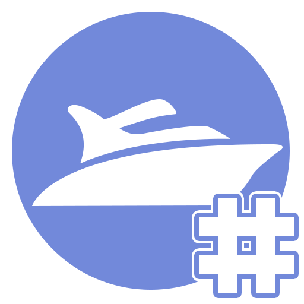

# Boats.NET
[](https://www.nuget.org/packages/Boats.NET)

This is the official API wrapper for the [Discord Boats](https://www.discord.boats) API.

## Usage
In order to reference this API, append this to the top of your file:
```cs
using DiscordBoats;
```


### Initializing a new client
You can either initialize a `BaseBoatClient` or `BoatClient`. Initializing a `BoatClient` requires an API token and the ID of the bot that this client is meant for.

Examples:
```cs
var baseClient = new BaseBoatClient();
var client = new BoatClient(BOT_ID, API_TOKEN);
```

### Retrieving a bot
```cs
await baseClient.GetBotAsync(BOT_ID);
await client.GetSelfAsync();
```

### Retrieving a user
```cs
await baseClient.GetUserAsync(USER_ID);
```

### Checking user votes
```cs
await baseClient.HasVotedAsync(BOT_ID, USER_ID);
await client.HasVotedAsync(USER_ID);
```

### Retrieving widgets
> `WidgetImageFormat.Svg` is used by default.

```cs
baseClient.GetWidgetUrl(BOT_ID, WidgetImageFormat.Png);
client.GetWidgetUrl();
```

### Updating guild count
> This is exclusive to the `BoatClient` class.

You can simply update your guild count by using the `UpdateGuildCountAsync()` method:
```cs
await client.UpdateGuildCountAsync(GUILD_COUNT);
```

## License
This repository uses the MIT License.

## Installation
You can install this library for a solution or project by right-clicking the main solution, and selecting `Manage NuGet packages...`. In here, you can now search for `Boats.NET`, and press the first matching entry to install.

#### NuGet
You can install this package from NuGet [here](https://www.nuget.org/packages/Boats.NET). Likewise, if you wish to install this from the console, you can simply type:
```
dotnet add package Boats.NET --version 2.0.0
```
